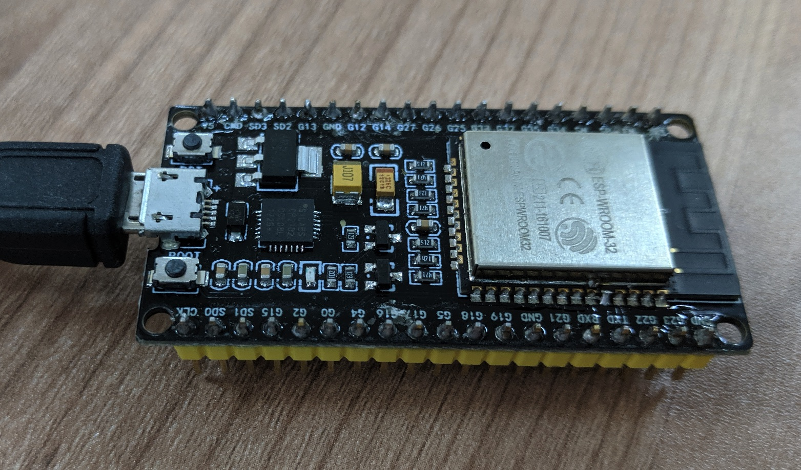
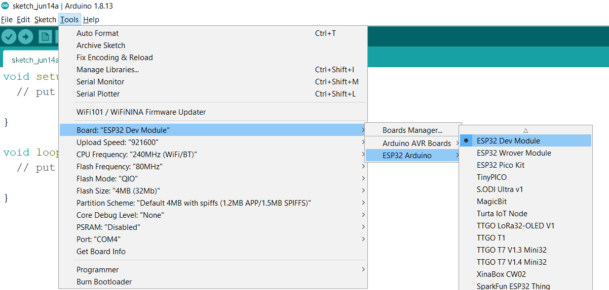
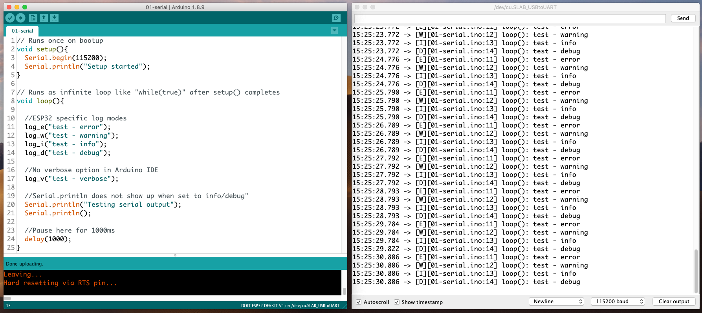

# 01-Serial

## Lesson Objectives
1. Verify Arduino SDK installed correctly as in the parent [README.md instructions](../README.md)
2. How to flash an Arduino program?
3. Using the serial console and ESP32 log facility

## Program behaviour

1. Open Serial port at 115200
2. Send `Setup started` and some log messages
3. MCU will send the text "Testing serial output" every second

## Programming and usage
1. Plug in the USB cable between the board and computer
2. Select the following settings

| Setting          | Value                  |
|------------------|------------------------|
| Board            | DOIT ESP32 DEVKIT V1   |
| Upload Speed     | 921600                 |
| Flash Frequency  | 80MHz                  |
| Core Debug Level | Debug or None          |
| Port             | /dev/cu.SLAB_USBtoUART |

3. Press magnifying glass button which is the Serial Console to open it. Set baud rate to `115200`, select other options as needed. 

4. Press the `right arrow ->` button which is the compile and upload. The code will take a few seconds to compile and upload and you should get the following.

The initial garbage output is normal as the Serial port is initialising on boot up. It is observed that the `test - verbose` string does not appear as the Arduino IDE does not have this compile option.

