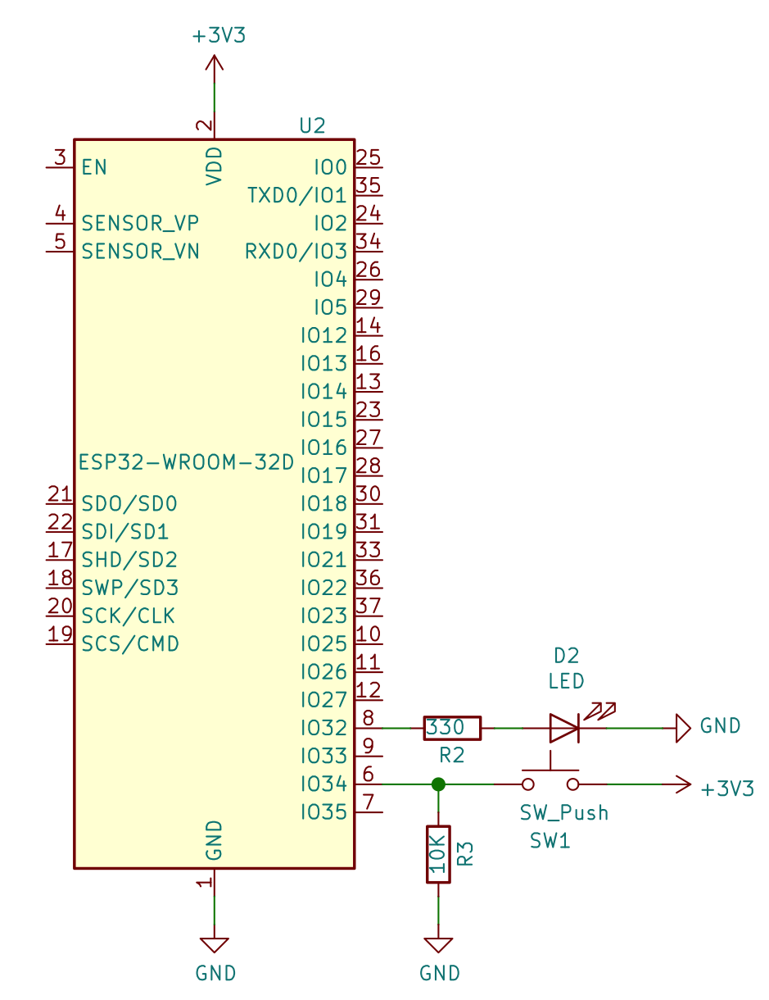

# 03-Button

## Lesson Objectives
1. How to wire up a button with pull-down resistor
2. Show that the looping speed of button press detection is too fast to be useful

## Program behaviour

1. On detection toggle the LED status
2. Send serial text `Changing LED state to: X`

## Connecting the button

